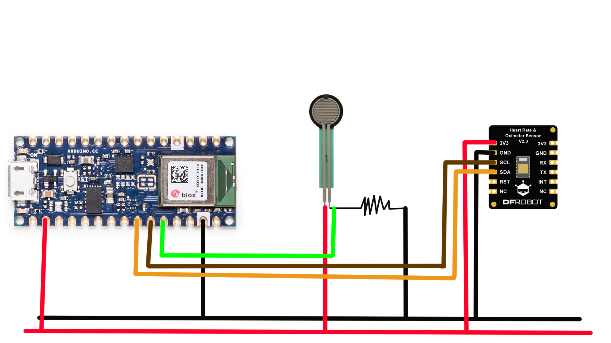
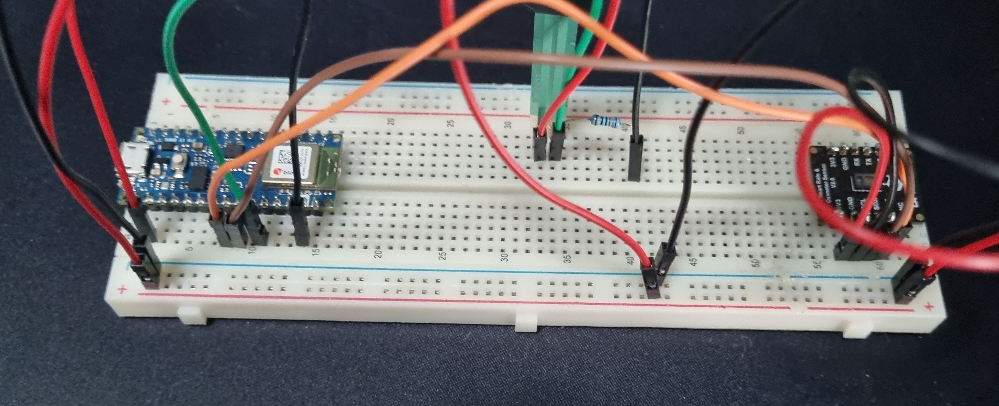

## Using the Arduino Nano 33 BLE and Max30102 to measure blood oxygen and heartrate, with the Zephyr RTOS

This code simulates the function of a wearable device using the DFRobot Max30102 to measure blood oxygen and heartrate values. 
The Max30102 is activated based on:
  1. Motion through the acceleration sensors on the Arduino
  2. Force values from the force sensor

The results are then transmitted through Bluetooth Low Energy, you can test this out with the nRF Connect app.

The parts were connected in the following way: (The resistor next to the force sensor affects its sensitivity)

    

